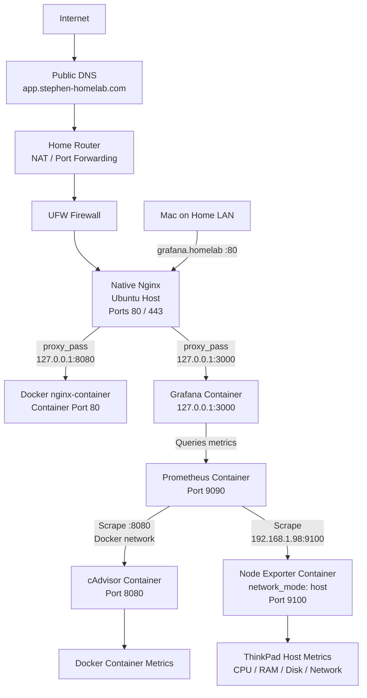

# Homelab

A self-hosted Linux homelab built on Ubuntu for learning Linux administration, networking, Docker, observability, reverse proxies, DNS, TLS, and infrastructure security.

## Architecture



### Architecture Overview

The ThinkPad acts as the Ubuntu homelab server.

Public traffic for `app.stephen-homelab.com` resolves through public DNS to the home router. The router forwards TCP ports 80 and 443 to the ThinkPad, where UFW controls inbound traffic and native Nginx acts as the reverse proxy and TLS termination point.

Native Nginx proxies the public application to a Dockerized Nginx test application through `127.0.0.1:8080`.

Grafana is kept private and is accessible from the home LAN through `grafana.homelab`. Native Nginx proxies these requests to Grafana through `127.0.0.1:3000`.

The monitoring stack consists of:

- **Grafana** — visualization and dashboards
- **Prometheus** — metrics collection and storage
- **cAdvisor** — Docker container metrics
- **Node Exporter** — ThinkPad host metrics

Prometheus scrapes cAdvisor over the internal Docker network. Node Exporter uses `network_mode: host` so it can observe the ThinkPad's host network interfaces and system metrics. Prometheus reaches Node Exporter through the ThinkPad host on port `9100`.

## Repository Structure

```text
homelab-repo/
├── README.md
├── .gitignore
│
├── etc/
│   └── nginx/
│       └── sites-available/
│           ├── app.stephen-homelab.com
│           └── grafana
│
├── homelab/
│   ├── monitoring/
│   │   ├── compose.yaml
│   │   └── prometheus/
│   │       └── prometheus.yml
│   │
│   └── nginx/
│       └── html/
│           └── index.html
│
├── docs/
│   ├── architecture.md
│   ├── stage-01-linux-ssh.md
│   ├── stage-02-nginx.md
│   ├── stage-03-docker.md
│   ├── stage-04-monitoring.md
│   └── stage-05-reverse-proxy-tls.md
│
└── diagrams/
    └── architecture.md
```

The repository mirrors selected parts of the live ThinkPad configuration. Runtime data, credentials, private keys, certificates, and other sensitive files are intentionally excluded.

## Completed Stages

### Stage 1 — Linux & SSH

- Configured Ubuntu host
- Configured SSH key authentication
- Enabled UFW firewall
- Configured DHCP reservation for a stable LAN IP

### Stage 2 — Native Nginx

- Installed Nginx directly on Ubuntu
- Deployed a basic HTTP service
- Practiced service management, socket inspection, and logging

### Stage 3 — Docker

- Installed Docker CE
- Deployed a containerized Nginx web service
- Configured container networking
- Configured port publishing
- Used bind mounts for persistent web content

### Stage 4 — Observability

- Deployed Prometheus and Grafana
- Added Node Exporter for host metrics
- Added cAdvisor for container metrics
- Built Grafana dashboards for CPU, memory, disk, network, and uptime
- Configured Node Exporter with host networking to observe the ThinkPad's real network interfaces
- Configured persistent Docker volumes for Prometheus and Grafana data

### Stage 5 — Reverse Proxy, DNS & TLS

- Configured native Nginx as the reverse proxy
- Configured local hostname resolution for private services
- Registered and configured a public domain
- Configured public DNS
- Configured router NAT / port forwarding for TCP 80 and 443
- Configured UFW rules
- Obtained a Let's Encrypt TLS certificate using Certbot
- Configured HTTPS and HTTP-to-HTTPS redirection
- Restricted backend Docker services from unnecessary network exposure
- Verified the TLS certificate and certificate chain

### Stage 6 — Nextcloud

Currently deploying a self-hosted Nextcloud service with:

- Dedicated database
- Persistent application and database storage
- Docker Compose
- Native Nginx reverse proxy
- HTTPS
