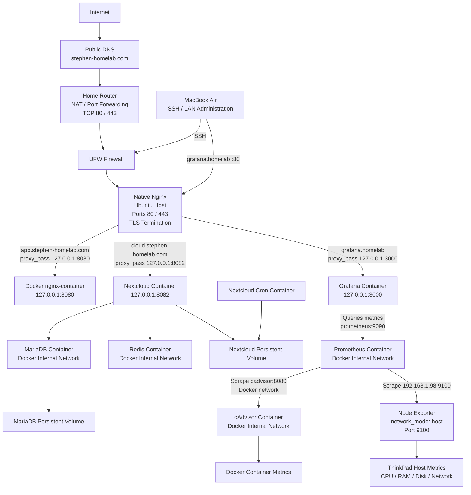

# Homelab

A self-hosted Linux homelab built on Ubuntu for learning Linux administration, networking, Docker, observability, reverse proxies, DNS, TLS, infrastructure security, and stateful application hosting.

## Architecture



### Architecture Overview

The ThinkPad acts as the Ubuntu homelab server and has the reserved LAN address `192.168.1.98`.

Public traffic for `app.stephen-homelab.com` and `cloud.stephen-homelab.com` resolves through public DNS to the home router. The router forwards TCP ports 80 and 443 to the ThinkPad, where UFW controls inbound traffic and native Nginx acts as the reverse proxy and TLS termination point.

Native Nginx routes requests based on hostname:

- `app.stephen-homelab.com` → `127.0.0.1:8080` → Docker Nginx test application
- `cloud.stephen-homelab.com` → `127.0.0.1:8082` → Nextcloud
- `grafana.homelab` → `127.0.0.1:3000` → Grafana

Nextcloud runs as a multi-container application using:

- **Nextcloud** — web application and file service
- **MariaDB** — database and application metadata
- **Redis** — caching and file locking
- **Nextcloud Cron** — scheduled background processing
- **Persistent Docker volumes** — Nextcloud and MariaDB data

MariaDB and Redis are not published to the host and are only reachable through the private Docker network.

The monitoring stack consists of:

- **Grafana** — visualization and dashboards
- **Prometheus** — metrics collection and storage
- **cAdvisor** — Docker container metrics
- **Node Exporter** — ThinkPad host metrics

Grafana queries Prometheus over Docker networking using `prometheus:9090`. Prometheus scrapes cAdvisor over the Docker network using `cadvisor:8080`.

Node Exporter uses `network_mode: host` so it can observe the ThinkPad's actual network interfaces and host metrics. Prometheus reaches Node Exporter through `192.168.1.98:9100`.

Unnecessary monitoring host exposure was reduced:

- Grafana is bound to `127.0.0.1:3000`
- Prometheus is not host-published
- cAdvisor is not host-published
- Node Exporter remains available on port `9100` through the restricted monitoring path

## Repository Structure

```text
homelab-repo/
├── README.md
├── .gitignore
│
├── etc/
│   └── nginx/
│       └── sites-available/
│           ├── app.stephen-homelab.com
│           ├── grafana
│           └── nextcloud
│
├── homelab/
│   ├── monitoring/
│   │   ├── compose.yaml
│   │   └── prometheus/
│   │       └── prometheus.yml
│   │
│   ├── nginx/
│   │   └── html/
│   │       └── index.html
│   │
│   └── nextcloud/
│       ├── compose.yaml
│       └── .env.example
│
├── docs/
    ├── architecture.md
    ├── stage-01-linux-ssh.md
    ├── stage-02-nginx.md
    ├── stage-03-docker.md
    ├── stage-04-monitoring.md
    ├── stage-05-reverse-proxy-tls.md
    └── stage-06-nextcloud.md

```

The repository mirrors selected parts of the live ThinkPad configuration.

Runtime data, credentials, `.env` files, private SSH keys, TLS private keys, certificates, database contents, Nextcloud user data, and other sensitive files are intentionally excluded.

## Completed Stages

### Stage 1 — Linux & SSH

- Configured Ubuntu host
- Configured SSH key authentication
- Enabled UFW firewall
- Configured DHCP reservation for a stable LAN IP
- Practiced Linux networking, service management, socket inspection, and system diagnostics

### Stage 2 — Native Nginx

- Installed Nginx directly on Ubuntu
- Deployed a basic HTTP service
- Practiced service management, socket inspection, HTTP testing, and logging

### Stage 3 — Docker

- Installed Docker CE
- Deployed a containerized Nginx web service
- Configured container networking
- Configured port publishing
- Used bind mounts for persistent web content
- Hardened the backend by changing the container binding from `0.0.0.0:8080` to `127.0.0.1:8080`

### Stage 4 — Observability

- Deployed Prometheus and Grafana
- Added Node Exporter for host metrics
- Added cAdvisor for container metrics
- Built Grafana dashboards for CPU, memory, disk, network, and uptime
- Configured Node Exporter with host networking to observe the ThinkPad's actual interfaces
- Used PromQL to query host and network metrics
- Diagnosed a real high-CPU issue involving `systemd-logind`
- Reduced unnecessary monitoring host exposure

### Stage 5 — Reverse Proxy, DNS & TLS

- Configured native Nginx as the reverse proxy
- Configured local hostname resolution for private services
- Registered and configured a public domain
- Configured public DNS
- Configured router NAT / port forwarding for TCP 80 and 443
- Configured UFW rules
- Obtained Let's Encrypt TLS certificates using Certbot
- Configured HTTPS and HTTP-to-HTTPS redirection
- Restricted backend Docker services from unnecessary network exposure
- Verified TLS certificates, certificate chains, and SNI behavior

### Stage 6 — Nextcloud

- Deployed Nextcloud as a multi-container Docker Compose application
- Deployed MariaDB as the Nextcloud database
- Added Redis for caching and file locking
- Added a dedicated Nextcloud cron container for background jobs
- Configured persistent Docker volumes for Nextcloud and MariaDB
- Restricted Nextcloud to `127.0.0.1:8082`
- Kept MariaDB and Redis private inside the Docker network
- Configured `cloud.stephen-homelab.com`
- Configured native Nginx as the Nextcloud reverse proxy
- Configured HTTPS using Let's Encrypt and Certbot
- Configured Nextcloud for reverse-proxy HTTPS awareness
- Verified Nextcloud access through web and mobile clients
- Enabled separate user accounts for personal, friends, and family access
- Integrated the new containers into the existing cAdvisor / Prometheus / Grafana monitoring architecture

## Current Public Request Flow

```text
Internet
   ↓
Public DNS
   ↓
Home public IPv4
   ↓
Router
   ↓
TCP 80 / 443
   ↓
ThinkPad 192.168.1.98
   ↓
UFW
   ↓
Native Nginx
   ├── app.stephen-homelab.com
   │      ↓
   │   127.0.0.1:8080
   │      ↓
   │   Docker Nginx
   │
   └── cloud.stephen-homelab.com
          ↓
       127.0.0.1:8082
          ↓
       Nextcloud
          ├── MariaDB
          ├── Redis
          ├── Cron
          └── Persistent Storage
```

## Security Model

The homelab currently follows these principles:

- Public web traffic enters only through native Nginx
- Only TCP ports 80 and 443 are forwarded from the router
- SSH is not publicly forwarded
- Backend applications are bound to loopback where possible
- MariaDB and Redis are not host-published
- Grafana is bound to loopback
- Prometheus and cAdvisor communicate over Docker networking rather than host-published ports
- Node Exporter access is restricted to the required monitoring path
- TLS terminates at native Nginx
- Secrets and `.env` files are excluded from Git
- TLS private keys are never committed or shared

## Current Learning Progression

```text
Stage 1
Linux + SSH + Networking
        ↓
Stage 2
Native Nginx
        ↓
Stage 3
Docker
        ↓
Stage 4
Prometheus + Grafana + Observability
        ↓
Stage 5
Reverse Proxy + DNS + NAT + TLS
        ↓
Stage 6
Nextcloud + MariaDB + Redis + Persistent Storage
```

Stage 6 introduced the first stateful production-style workload in the homelab. The next major operational step is implementing backups and restore testing for both Nextcloud data and MariaDB.

