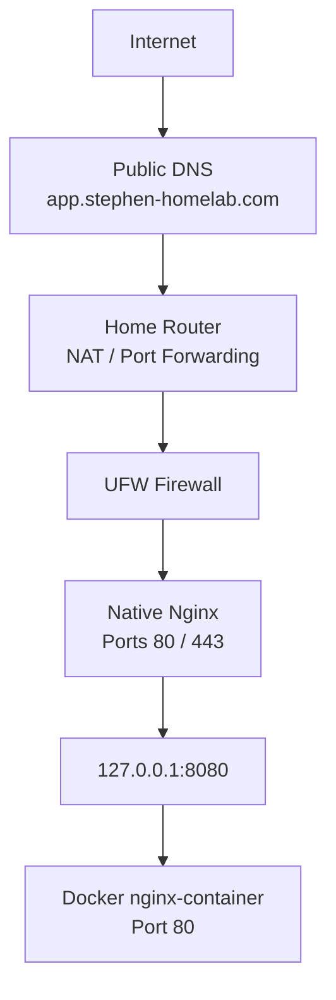

# Homelab Architecture


## Architecture Diagram



## Purpose

This homelab is a Linux/SRE learning environment built on a Lenovo ThinkPad T550 running Ubuntu and administered from a MacBook Air.

The project is intended to develop practical experience with:

- Linux administration
- SSH and authentication
- IP networking
- Firewalls
- systemd
- Nginx
- Docker and Docker Compose
- Reverse proxies
- DNS
- NAT and port forwarding
- TLS/HTTPS
- Prometheus
- Grafana
- Node Exporter
- cAdvisor
- Troubleshooting by network/application layer
- Stateful application hosting

---

## Core Host

| Component | Value |
|---|---|
| Server | Lenovo ThinkPad T550 |
| OS | Ubuntu |
| Ubuntu user | `stephen` |
| Hostname | `stephen-ThinkPad-T550` |
| LAN IP | `192.168.1.98` |
| Client | MacBook Air |
| SSH alias | `homelab` |
| Firewall | UFW |
| Public domain | `stephen-homelab.com` |

The router has a DHCP reservation for the ThinkPad so the server continues receiving:

```text
192.168.1.98
```

This provides a stable destination for SSH, reverse proxying, monitoring and router port forwarding.

---

# Current Architecture — Stages 1 to 5

```text
                              Internet
                                 |
                                 | DNS
                                 v
                    app.stephen-homelab.com
                                 |
                                 v
                         Home public IPv4
                                 |
                                 v
                       Singtel home router
                       NAT / port forwarding
                     TCP 80  -> 192.168.1.98:80
                     TCP 443 -> 192.168.1.98:443
                                 |
                                 v
                     ThinkPad 192.168.1.98
                                 |
                                UFW
                                 |
                       +---------+---------+
                       |                   |
                     :80                 :443
                       |                   |
                       +---------+---------+
                                 |
                         Native Nginx
                    HTTP/HTTPS entry point
                                 |
                         TLS termination
                                 |
                         reverse proxy
                                 |
                                 v
                       127.0.0.1:8080
                                 |
                                 v
                       Docker port mapping
                                 |
                                 v
                     nginx-container:80
```

The public Docker application is deliberately bound to:

```text
127.0.0.1:8080
```

rather than:

```text
0.0.0.0:8080
```

This means clients cannot bypass Nginx and reach the Docker application directly through:

```text
192.168.1.98:8080
```

Only software running on the ThinkPad can reach the backend port.

---

# Private Monitoring Architecture

```text
MacBook
   |
   | grafana.homelab
   v
Native Nginx
   |
   v
Grafana :3000
   |
   | Docker Compose DNS
   v
Prometheus :9090
   |
   +------------------------------+
   |                              |
   v                              v
cAdvisor :8080              Node Exporter :9100
   |                              |
Docker container metrics       Ubuntu host metrics
```

## Responsibilities

### Node Exporter

Collects host-level metrics such as:

- CPU
- memory
- disk
- filesystem
- network interfaces
- uptime
- load

Prometheus currently reaches Node Exporter using:

```text
192.168.1.98:9100
```

Node Exporter uses host networking so metrics expose actual Ubuntu interfaces such as:

```text
wlp3s0
```

### cAdvisor

Collects Docker/container-level metrics such as:

- container CPU usage
- memory usage
- network traffic
- container filesystem/resource statistics

Prometheus reaches it using Docker Compose DNS:

```text
cadvisor:8080
```

### Prometheus

Prometheus:

1. Scrapes metric endpoints.
2. Stores time-series data.
3. Executes PromQL queries.

### Grafana

Grafana visualizes data stored in Prometheus.

Grafana uses the Prometheus datasource:

```text
http://prometheus:9090
```

This hostname works because both services share a Docker Compose network and Docker provides internal DNS.

---

# Local Name Resolution

Private hostnames such as:

```text
grafana.homelab
app.homelab
```

are resolved on the Mac using `/etc/hosts`.

Example:

```text
192.168.1.98 grafana.homelab
192.168.1.98 app.homelab
```

This is local static name resolution. It is different from public DNS.

---

# Public DNS

Public DNS maps:

```text
app.stephen-homelab.com
```

to the home's public IPv4 address.

The request is then routed through the home router to the ThinkPad using port forwarding.

Only these public ports should be forwarded:

```text
TCP 80
TCP 443
```

Do not expose:

```text
22
3000
8080
8081
9090
9100
```

to the public Internet.

---

# Request Flow — Public HTTPS Application

When an Internet client visits:

```text
https://app.stephen-homelab.com
```

the request flows through:

```text
Client
  |
  | DNS lookup
  v
Public DNS
  |
  v
Home public IPv4
  |
  v
Router
  |
  | DNAT / port forward TCP 443
  v
192.168.1.98:443
  |
  v
UFW
  |
  v
Native Nginx
  |
  | TLS handshake / certificate
  | Host: app.stephen-homelab.com
  v
Correct Nginx virtual host
  |
  | proxy_pass
  v
127.0.0.1:8080
  |
  v
Docker nginx-container:80
```

---

# TLS Architecture

TLS terminates at native Nginx.

```text
Internet client
      |
      | HTTPS
      v
Native Nginx :443
      |
      | TLS decrypted
      v
HTTP backend request
      |
      v
127.0.0.1:8080
```

Let's Encrypt certificates are managed using Certbot.

Useful certificate checks:

```bash
sudo certbot certificates
sudo certbot renew --dry-run
```

TLS can be inspected manually using:

```bash
openssl s_client \
  -connect app.stephen-homelab.com:443 \
  -servername app.stephen-homelab.com
```

The certificate private key must never be shared or committed to Git.

---

# Firewall Model

UFW is enabled.

Desired policy:

```text
Default incoming: deny
Default outgoing: allow
```

Expected permitted paths include:

- OpenSSH for LAN administration
- Nginx HTTP/HTTPS
- Node Exporter only where required by the monitoring architecture

The restricted Node Exporter rule is:

```text
9100/tcp ALLOW IN 172.18.0.0/16
```

The exact Docker network should be verified before relying on that subnet:

```bash
docker network inspect monitoring_default | grep Subnet
```

---

# Troubleshooting Model

Troubleshoot from the outside inward.

## 1. DNS

```bash
dig +short app.stephen-homelab.com
```

## 2. Public routing / NAT

Confirm the hostname resolves to the correct public IP and the router forwards TCP 80/443 to:

```text
192.168.1.98
```

## 3. UFW

```bash
sudo ufw status verbose
```

## 4. Listening sockets

```bash
sudo ss -tlnp
```

## 5. Nginx

```bash
sudo nginx -t
sudo systemctl status nginx
```

## 6. TLS

```bash
openssl s_client \
  -connect app.stephen-homelab.com:443 \
  -servername app.stephen-homelab.com
```

## 7. Backend

```bash
curl http://127.0.0.1:8080
```

## 8. Complete request

```bash
curl -v https://app.stephen-homelab.com
```

This isolates failures by layer instead of randomly changing configuration.

---

# Target Architecture — Stage 6 Nextcloud

The intended next stage is a stateful Nextcloud deployment.

```text
                       Internet
                          |
                          v
             cloud.stephen-homelab.com
                          |
                          v
                     Router :443
                          |
                          v
                    Native Nginx
                          |
                    TLS termination
                          |
                          v
                  127.0.0.1:8082
                          |
                          v
                   Nextcloud app
                     /       \
                    /         \
                   v           v
              MariaDB         Redis
                   |
                   v
             Persistent data

Additional:
Nextcloud cron container
Persistent Docker volumes
```

The database and Redis should remain internal to the Docker network.

They should not have host-published ports.

---

# Security Principles Used

1. **Expose only required ports.**
2. **Use SSH keys instead of relying on password authentication.**
3. **Keep backend Docker services bound to loopback where possible.**
4. **Use native Nginx as the single public HTTP/HTTPS entry point.**
5. **Terminate TLS at Nginx.**
6. **Do not expose monitoring services publicly.**
7. **Keep credentials and certificate private keys out of Git.**
8. **Separate public ingress from internal service communication.**
9. **Verify every configuration change using direct tests.**
10. **Troubleshoot systematically by layer.**
