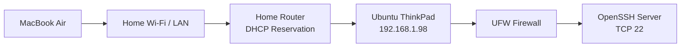

# Stage 01 — Linux Host and SSH


## Architecture Diagram



## Objective

Establish a manageable Ubuntu server that can be administered remotely from a MacBook while learning fundamental Linux, networking, service and firewall concepts.

---

# Final State

The ThinkPad runs Ubuntu with:

```text
Hostname: stephen-ThinkPad-T550
User: stephen
LAN IP: 192.168.1.98
```

The Mac connects using:

```bash
ssh homelab
```

The alias ultimately connects to:

```text
stephen@192.168.1.98
```

using an Ed25519 SSH key.

---

# 1. Identify the Server's Network Configuration

Useful commands:

```bash
ip addr
ip route
```

## `ip addr`

Displays network interfaces and assigned addresses.

Important concepts learned:

- loopback interface
- physical/Wi-Fi interfaces
- IPv4 addresses
- subnet prefixes
- interface state

The important server address became:

```text
192.168.1.98
```

## `ip route`

Displays the routing table.

Typical information includes:

```text
default via <router-IP>
192.168.1.0/24 dev <interface>
```

The default route tells Linux where to send packets destined for networks outside the local subnet.

---

# 2. Reserve the Server IP

A DHCP reservation was configured on the home router so the ThinkPad consistently receives:

```text
192.168.1.98
```

This is important because other configurations depend on this address:

- SSH
- `/etc/hosts`
- monitoring
- Nginx access
- router port forwarding

Without a stable address, the server could receive a different IP after a DHCP lease change or reboot.

---

# 3. Install OpenSSH Server

OpenSSH Server allows remote SSH connections to the Ubuntu machine.

Service inspection:

```bash
systemctl status ssh
```

Socket inspection:

```bash
sudo ss -tlnp | grep :22
```

This verifies that `sshd` is listening on TCP port 22.

---

# 4. Initial SSH Access

From the Mac:

```bash
ssh stephen@192.168.1.98
```

Before key authentication was configured, a machine on the LAN could attempt SSH authentication against the server if it could reach port 22.

Network reachability and authentication are separate concepts:

```text
Can reach TCP 22
        !=
Can successfully authenticate
```

---

# 5. Create SSH Key Authentication

An Ed25519 key pair was created on the Mac.

Example structure:

```text
Private key:
~/.ssh/id_ed25519_homelab

Public key:
~/.ssh/id_ed25519_homelab.pub
```

The private key remains on the Mac.

The public key is installed on Ubuntu in:

```text
~/.ssh/authorized_keys
```

Conceptually:

```text
Mac private key
      |
      | proves identity
      v
Ubuntu sshd
      |
      | checks matching public key
      v
authorized_keys
```

Never copy the private key to the server or publish it.

---

# 6. SSH Alias

The Mac SSH client configuration was updated so that:

```bash
ssh homelab
```

can be used instead of:

```bash
ssh stephen@192.168.1.98
```

A configuration entry conceptually looks like:

```text
Host homelab
    HostName 192.168.1.98
    User stephen
    IdentityFile ~/.ssh/id_ed25519_homelab
```

This is client-side configuration on the Mac.

---

# 7. Configure UFW

UFW was enabled with SSH access preserved.

Useful commands:

```bash
sudo ufw status verbose
sudo ufw allow OpenSSH
sudo ufw enable
```

Security principle:

```text
Allow SSH first
then enable firewall
```

Otherwise remote administration can accidentally be blocked.

Desired policy:

```text
Incoming: deny unless explicitly allowed
Outgoing: allow
```

---

# 8. Keep the Laptop Awake with the Lid Closed

Initially the ThinkPad became unreachable after the lid was closed.

Symptoms:

```text
ping failed
SSH failed
```

This was not primarily an SSH problem.

The host itself was suspending.

Later, systemd-logind lid/idle handling was configured to prevent unwanted suspend behavior.

This became relevant again during Stage 4, when repeated suspend attempts caused abnormally high CPU usage.

---

# 9. Core Linux Commands Learned

## Disk usage

```bash
df -h
```

Shows filesystem capacity and free space.

## Memory

```bash
free -h
```

Shows memory and swap usage.

## Uptime

```bash
uptime
uptime -p
```

Shows how long the system has been running.

## Services

```bash
systemctl status <service>
systemctl start <service>
systemctl stop <service>
systemctl restart <service>
systemctl enable <service>
```

## Listening sockets

```bash
sudo ss -tulpn
```

Useful options:

```text
-t  TCP
-u  UDP
-l  listening
-p  process
-n  numeric addresses/ports
```

This became one of the most useful troubleshooting commands in later stages.

---

# 10. Package Manager Lock Troubleshooting

During package installation, `apt` was temporarily blocked by another process.

Example concept:

```text
apt
 |
 X
another apt/aptd process owns lock
```

The lesson was not to delete lock files blindly.

Instead identify the process that currently owns the package-manager lock and determine whether it is legitimately running.

---

# Validation Checklist

```bash
ip addr
ip route
systemctl status ssh
sudo ss -tlnp | grep :22
sudo ufw status verbose
df -h
free -h
uptime -p
```

From the Mac:

```bash
ssh homelab
```

Expected result:

```text
successful key-based SSH session
```

---

# Architecture After Stage 1

```text
MacBook Air
     |
     | Wi-Fi LAN
     |
     | SSH TCP 22
     v
ThinkPad
192.168.1.98
     |
     +-- OpenSSH Server
     +-- UFW
     +-- Ubuntu / systemd
```

---

# Key Lessons

- IP reachability and authentication are different problems.
- A stable server IP is important for infrastructure.
- SSH uses a client/server model.
- Public keys may be installed on servers; private keys must remain private.
- `systemctl` answers whether a service is running.
- `ss` answers whether a socket is listening.
- UFW determines whether traffic is permitted.
- Successful troubleshooting requires separating service, socket, network and firewall state.
