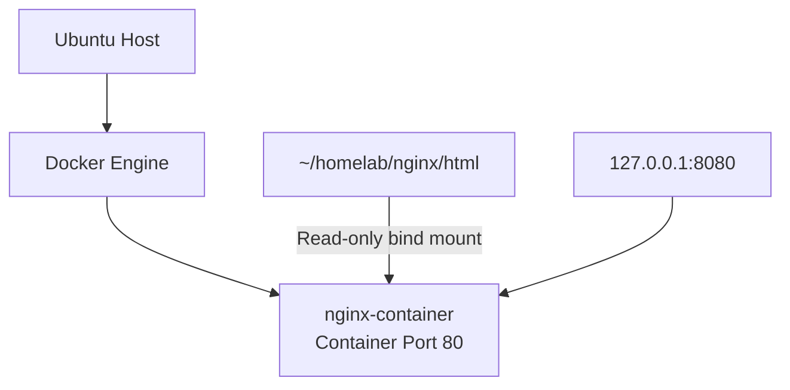

# Stage 03 — Docker


## Architecture Diagram



## Objective

Learn container fundamentals and deploy an Nginx application independently from the native host Nginx installation.

---

# Docker Installation

Docker CE was installed using the official Docker packages:

- `docker-ce`
- `docker-ce-cli`
- `containerd.io`
- Docker Buildx
- Docker Compose plugin

An earlier installation attempt using Ubuntu's `docker.io` package created a `containerd` package conflict.

The final environment uses Docker's official packages.

---

# Core Concepts

## Image

An image is the packaged filesystem and application definition used to create containers.

Example:

```text
nginx
```

## Container

A container is a running instance of an image.

Example:

```text
nginx-container
```

## Volume / Bind Mount

Persistent or host-provided files can be mounted into a container.

The Nginx test page is stored on the host:

```text
~/homelab/nginx/html
```

and mounted into:

```text
/usr/share/nginx/html
```

inside the container.

## Port Publishing

Container ports are isolated unless explicitly published.

---

# Docker Networks

Default Docker network types learned:

```text
bridge
host
none
```

## Bridge

Containers receive private Docker network addresses.

Example observed:

```text
172.17.0.2
```

Traffic between host/LAN and the container requires routing or port publishing.

## Host

The container shares the host network namespace.

This became useful later for Node Exporter.

## None

No normal network connectivity is configured.

---

# Initial Nginx Container

The initial container was published with:

```bash
-p 8080:80
```

This is effectively:

```text
0.0.0.0:8080 -> container:80
```

Meaning:

```text
Mac -> 192.168.1.98:8080 -> container:80
```

could work directly.

---

# Bind Mount

The page was mounted read-only:

```bash
-v ~/homelab/nginx/html:/usr/share/nginx/html:ro
```

Breakdown:

```text
Host:
~/homelab/nginx/html

Container:
/usr/share/nginx/html

Mode:
read-only
```

The container can read the page but should not modify the host files through that mount.

---

# Hardened Container

The container was later recreated using:

```bash
docker run \
  --name nginx-container \
  -d \
  --restart unless-stopped \
  -p 127.0.0.1:8080:80 \
  -v ~/homelab/nginx/html:/usr/share/nginx/html:ro \
  nginx
```

The important change is:

```bash
-p 127.0.0.1:8080:80
```

instead of:

```bash
-p 8080:80
```

---

# Port Binding Difference

## Broad host binding

```text
-p 8080:80
```

is effectively:

```text
0.0.0.0:8080 -> container:80
```

Any network interface on the host can potentially receive that traffic.

Example:

```text
Mac
 |
 v
192.168.1.98:8080
 |
 v
Docker
 |
 v
container:80
```

## Loopback-only binding

```text
-p 127.0.0.1:8080:80
```

means:

```text
127.0.0.1:8080 -> container:80
```

Only applications running on the ThinkPad can connect to that socket.

This creates:

```text
Mac -> 192.168.1.98:8080
                 X

Native Nginx -> 127.0.0.1:8080
                 |
                 v
           Docker Nginx
```

This became the security model used for Stage 5.

---

# Restart Policy

The container uses:

```text
--restart unless-stopped
```

Docker attempts to restart it after:

- Docker daemon restart
- host reboot
- unexpected container exit

unless the container was intentionally stopped.

---

# Useful Commands

## List running containers

```bash
docker ps
```

## List all containers

```bash
docker ps -a
```

## View logs

```bash
docker logs nginx-container
```

## Stop

```bash
docker stop nginx-container
```

## Start

```bash
docker start nginx-container
```

## Remove

```bash
docker rm nginx-container
```

## Inspect

```bash
docker inspect nginx-container
```

## View networks

```bash
docker network ls
```

## Inspect bridge network

```bash
docker network inspect bridge
```

---

# Container Operating System Observation

The Nginx container used Debian-based userspace.

Observed:

```text
Debian 13 / trixie
```

Some utilities such as `ps` were not installed because containers are often deliberately minimal.

This demonstrated that:

```text
Host OS
!=
Container userspace
```

even though they share the same Linux kernel.

---

# Validation

Check the published port:

```bash
docker ps
```

Expected hardened mapping:

```text
127.0.0.1:8080->80/tcp
```

Test from the host:

```bash
curl http://127.0.0.1:8080
```

Inspect listening socket:

```bash
sudo ss -tlnp | grep :8080
```

Expected:

```text
127.0.0.1:8080
```

A LAN client should not be able to bypass the reverse proxy through:

```text
192.168.1.98:8080
```

---

# Architecture After Stage 3

```text
ThinkPad
   |
   +-- Native Nginx :80
   |
   +-- Docker
          |
          +-- nginx-container
                  |
                  +-- container :80
                  |
                  +-- host binding:
                      127.0.0.1:8080
```

At this stage native Nginx and Docker Nginx were separate applications.

---

# Key Lessons

- Images and containers are different objects.
- Containers can have their own filesystem and userspace.
- Docker bridge networking provides private container addresses.
- Port publishing is a host-level exposure decision.
- `0.0.0.0` and `127.0.0.1` have very different security implications.
- Bind mounts can provide application content from the host.
- Backend services do not need LAN exposure when a reverse proxy can reach them locally.
