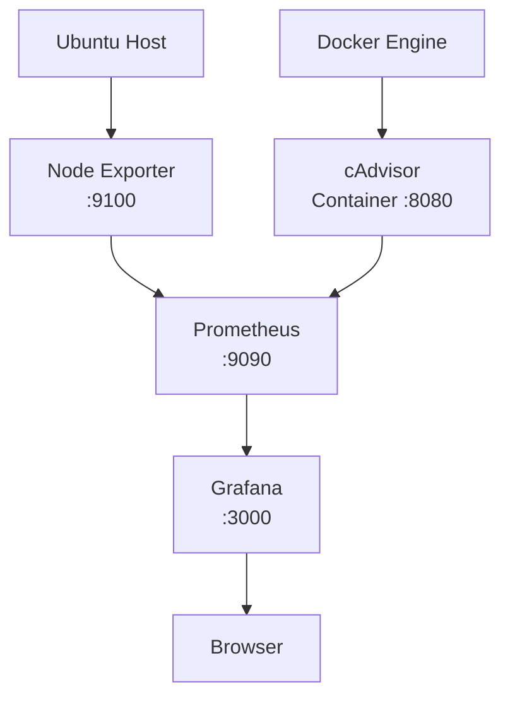

# Stage 04 — Monitoring with Prometheus and Grafana


## Architecture Diagram



## Objective

Build a monitoring stack for the Ubuntu host and Docker containers while learning metrics, exporters, PromQL and service-to-service networking.

---

# Monitoring Directory

```text
~/homelab/monitoring
```

The stack is managed using Docker Compose.

---

# Components

The monitoring stack contains:

```text
Grafana
Prometheus
Node Exporter
cAdvisor
```

---

# Architecture

```text
Ubuntu host
   |
   +---------------- Node Exporter
   |                     |
   |                     | host metrics
   |                     v
   |                  :9100
   |
   +-- Docker Engine
         |
         +-- application containers
         |
         +-- cAdvisor
                |
                | container metrics
                v
             :8080

Prometheus
   |
   +-- scrape Node Exporter
   +-- scrape cAdvisor
   |
   v
time-series database
   |
   v
Grafana
```

---

# Grafana

Host/container port:

```text
3000
```

Grafana is used to visualize Prometheus data.

Prometheus datasource:

```text
http://prometheus:9090
```

`prometheus` is the Docker Compose service name.

Docker's internal DNS resolves this name to the Prometheus container.

---

# Prometheus

Host/container port:

```text
9090
```

Prometheus periodically scrapes metric endpoints and stores time-series data.

It does not usually obtain operating-system metrics directly.

Instead, exporters expose those metrics.

---

# Node Exporter

Node Exporter provides Ubuntu host metrics such as:

- CPU
- memory
- filesystem
- disk
- networking
- uptime

It eventually used:

```text
network_mode: host
```

so it could expose the actual host interfaces, including:

```text
wlp3s0
```

Prometheus scrapes Node Exporter through:

```text
192.168.1.98:9100
```

---

# cAdvisor

cAdvisor collects Docker container metrics.

Host mapping:

```text
8081 -> container 8080
```

Prometheus reaches cAdvisor internally through Docker Compose DNS:

```text
cadvisor:8080
```

This avoids requiring Prometheus to use the host-published `8081` path.

---

# Why Node Exporter Networking Changed

The goal was to monitor the ThinkPad's real Wi-Fi interface:

```text
wlp3s0
```

A normally isolated container does not necessarily see the host network namespace as the host sees it.

Using:

```text
network_mode: host
```

allowed Node Exporter to observe host interfaces directly.

The architecture changed from conceptually:

```text
Prometheus
   |
   v
container-network Node Exporter
   |
   X
full host interface visibility
```

to:

```text
Prometheus
   |
   v
192.168.1.98:9100
   |
   v
Node Exporter using host network namespace
   |
   v
wlp3s0 and host networking metrics
```

---

# UFW and Node Exporter

An initial problem occurred because Prometheus could not reach Node Exporter through the required path.

A restricted firewall rule was added:

```text
9100/tcp ALLOW IN 172.18.0.0/16
```

This should not be treated as universally correct.

The actual Docker subnet should be verified:

```bash
docker network inspect monitoring_default | grep Subnet
```

The intention is:

```text
Allow Prometheus/Docker network
        |
        v
Node Exporter :9100

Do not broadly expose 9100
```

---

# Prometheus Targets

Prometheus target status can be interpreted as:

```text
UP
```

Prometheus successfully scraped the exporter.

```text
DOWN
```

Prometheus could not scrape the exporter.

The Node Exporter path was validated using:

```bash
curl http://localhost:9100/metrics
```

and:

```bash
curl http://192.168.1.98:9100/metrics
```

A deliberate test was also performed:

```bash
docker stop node-exporter
```

Prometheus reported:

```text
up = 0
```

After restarting:

```bash
docker start node-exporter
```

Prometheus returned:

```text
up = 1
```

This demonstrated real monitoring of service availability.

---

# Grafana Dashboard

Dashboard:

```text
ThinkPad Homelab
```

Panels include:

- CPU usage
- memory usage
- disk space
- Wi-Fi receive/transmit traffic
- system uptime

---

# Important PromQL

## CPU Usage

```promql
100 - (
  avg by (instance) (
    rate(node_cpu_seconds_total{mode="idle"}[5m])
  ) * 100
)
```

Interpretation:

1. Take CPU time spent idle.
2. Calculate its rate over five minutes.
3. Average it by instance.
4. Convert idle fraction to percentage.
5. Subtract from 100.

Result:

```text
estimated CPU usage percentage
```

---

# Network Receive

```promql
rate(node_network_receive_bytes_total{device="wlp3s0"}[5m])
```

This calculates average received bytes per second on `wlp3s0` over a five-minute window.

---

# Network Transmit

```promql
rate(node_network_transmit_bytes_total{device="wlp3s0"}[5m])
```

This calculates average transmitted bytes per second.

---

# Uptime

```promql
time() - node_boot_time_seconds
```

This calculates:

```text
current Unix timestamp
-
boot timestamp
=
seconds since boot
```

---

# Load Testing

CPU load was intentionally generated using:

```bash
yes > /dev/null
```

This creates a CPU-intensive process.

Memory load was generated using a Python allocation similar to:

```bash
python3 -c "x=bytearray(2*1024*1024*1024); import time; time.sleep(300)"
```

This allocated approximately 2 GiB of memory for several minutes.

Grafana was then used to observe the resulting changes.

---

# Real High-CPU Incident

Monitoring identified unexpectedly high CPU usage associated with:

```text
systemd-logind
```

The process was observed consuming approximately:

```text
~83% CPU
```

The cause was repeated suspend behavior while suspend targets had been masked.

The lid/idle configuration in:

```text
/etc/systemd/logind.conf
```

was changed so the relevant actions were ignored.

After the change, Grafana confirmed CPU recovery.

This was an important SRE lesson:

```text
Monitoring
   |
   v
Detect abnormal resource use
   |
   v
Identify process
   |
   v
Investigate system behavior
   |
   v
Change configuration
   |
   v
Verify recovery using metrics
```

---

# Useful Commands

Start the stack:

```bash
cd ~/homelab/monitoring
docker compose up -d
```

Inspect:

```bash
docker compose ps
docker ps
```

Logs:

```bash
docker compose logs
docker compose logs prometheus
docker compose logs grafana
```

Check Node Exporter metrics:

```bash
curl -s http://192.168.1.98:9100/metrics | head
```

Check Docker network:

```bash
docker network inspect monitoring_default
```

---

# Monitoring Request Flow

```text
Node Exporter --------+
                      |
                      v
                 Prometheus
                      |
cAdvisor -------------+
                      |
                      v
                   Grafana
                      |
                      v
                Browser/User
```

Grafana does not normally collect these metrics itself.

The responsibilities are:

```text
Exporter/cAdvisor -> expose metrics
Prometheus        -> scrape/store/query
Grafana           -> visualize
```

---

# Key Lessons

- Monitoring is separate from application hosting.
- Exporters translate system state into Prometheus metrics.
- Prometheus uses a pull/scrape model.
- Grafana visualizes data but is not the source of the metrics.
- Docker service names provide internal DNS.
- Network namespaces affect what interfaces containers can observe.
- Firewall rules can break monitoring even when both services are running.
- PromQL transforms raw counters into useful operational signals.
- Monitoring is valuable because it can detect real operational problems, not just create dashboards.
