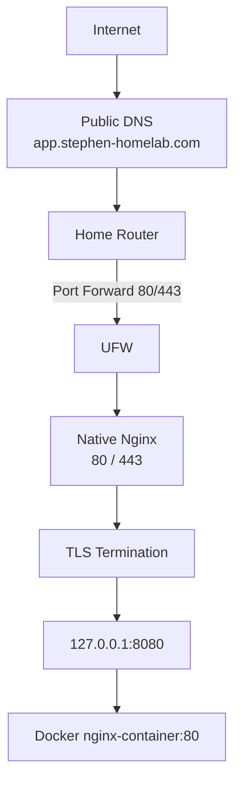

# Stage 05 — Reverse Proxy, Public DNS and HTTPS


## Architecture Diagram



## Objective

Turn native Nginx into the controlled ingress point for Docker applications and expose a test application securely using:

- public DNS
- router NAT/port forwarding
- UFW
- Nginx virtual hosts
- reverse proxying
- TLS
- Let's Encrypt
- Certbot

---

# Architecture

```text
Internet
   |
   | DNS
   v
app.stephen-homelab.com
   |
   v
Home public IPv4
   |
   v
Router
   |
   | TCP 80/443 port forward
   v
192.168.1.98
   |
   v
UFW
   |
   v
Native Nginx :80/:443
   |
   | TLS termination
   | reverse proxy
   v
127.0.0.1:8080
   |
   v
Docker nginx-container:80
```

---

# Local Reverse Proxy Practice

Private hostnames were initially configured using the Mac's `/etc/hosts`.

Examples:

```text
grafana.homelab
app.homelab
```

Example `/etc/hosts` entries:

```text
192.168.1.98 grafana.homelab
192.168.1.98 app.homelab
```

This allowed local hostname-based testing without public DNS.

---

# Grafana Reverse Proxy

A native Nginx virtual host similar to this was created:

```nginx
server {
    listen 80;
    server_name grafana.homelab;

    location / {
        proxy_pass http://127.0.0.1:3000;

        proxy_set_header Host $host;
        proxy_set_header X-Real-IP $remote_addr;
        proxy_set_header X-Forwarded-For $proxy_add_x_forwarded_for;
        proxy_set_header X-Forwarded-Proto $scheme;
    }
}
```

Flow:

```text
Mac
 |
 | http://grafana.homelab
 v
192.168.1.98:80
 |
 v
Native Nginx
 |
 | Host header selects vhost
 v
127.0.0.1:3000
 |
 v
Grafana
```

---

# Reverse Proxy Concept

The client connects only to Nginx.

Nginx then makes a new backend connection.

```text
Client connection:
Client -> Nginx

Backend connection:
Nginx -> application
```

These are two separate TCP connections.

---

# Docker Application Hardening

The Docker test application was changed from:

```bash
-p 8080:80
```

to:

```bash
-p 127.0.0.1:8080:80
```

Before:

```text
Mac -> 192.168.1.98:8080 -> Docker app
```

After:

```text
Mac -> 192.168.1.98:8080
                 X

Nginx -> 127.0.0.1:8080
                 |
                 v
             Docker app
```

The reverse proxy therefore became the required entry path.

---

# Public Domain

The public domain:

```text
stephen-homelab.com
```

was configured.

The public test application uses:

```text
app.stephen-homelab.com
```

An A record resolves the hostname to the home's public IPv4.

Verify:

```bash
dig +short app.stephen-homelab.com
```

---

# Router Port Forwarding

Only the web ingress ports are forwarded:

```text
WAN TCP 80
    ->
192.168.1.98:80

WAN TCP 443
    ->
192.168.1.98:443
```

Do not forward:

```text
22
3000
8080
8081
9090
9100
```

---

# Why Only One Pair of Port Forwards Is Needed

Multiple applications can share public TCP ports 80 and 443 because Nginx selects a virtual host using the HTTP hostname.

Example:

```text
app.stephen-homelab.com
         |
         v
       Nginx
         |
         v
127.0.0.1:8080
```

Future example:

```text
cloud.stephen-homelab.com
         |
         v
       Nginx
         |
         v
127.0.0.1:8082
```

No additional router forward is needed for every application.

---

# Public Nginx Virtual Host

The public test application uses:

```text
server_name app.stephen-homelab.com;
```

and proxies to:

```text
http://127.0.0.1:8080
```

Conceptually:

```nginx
location / {
    proxy_pass http://127.0.0.1:8080;

    proxy_set_header Host $host;
    proxy_set_header X-Real-IP $remote_addr;
    proxy_set_header X-Forwarded-For $proxy_add_x_forwarded_for;
    proxy_set_header X-Forwarded-Proto $scheme;
}
```

---

# Nginx Validation

Before reload:

```bash
sudo nginx -t
```

Then:

```bash
sudo systemctl reload nginx
```

Useful socket check:

```bash
sudo ss -tlnp | grep -E ':80|:443'
```

---

# TLS

Certbot was installed through Snap and used to obtain a Let's Encrypt certificate for:

```text
app.stephen-homelab.com
```

HTTPS works externally.

HTTP redirects to HTTPS using:

```text
301 Moved Permanently
```

---

# HTTPS Request Flow

```text
Browser
   |
   | TCP connection to :443
   v
Router
   |
   v
ThinkPad :443
   |
   v
Native Nginx
   |
   | TLS handshake
   | certificate presented
   | encrypted session established
   v
HTTP request inside TLS
   |
   | Host: app.stephen-homelab.com
   v
Nginx virtual host
   |
   v
proxy_pass http://127.0.0.1:8080
   |
   v
Docker application
```

---

# HTTP Sent to HTTPS Port

A test such as:

```bash
curl http://192.168.1.98:443
```

sends plaintext HTTP to a port configured for HTTPS/TLS.

Nginx can respond with:

```text
400 The plain HTTP request was sent to HTTPS port
```

The port number itself does not magically convert HTTP into HTTPS.

The application protocol used by the client must match what the server expects.

---

# TLS Verification

Useful command:

```bash
openssl s_client \
  -connect app.stephen-homelab.com:443 \
  -servername app.stephen-homelab.com
```

The `-servername` argument provides SNI.

SNI allows the client to tell the TLS server which hostname it wants before the HTTP Host header can be read.

This matters when one Nginx server hosts multiple HTTPS domains.

---

# Certificate Management

List certificates:

```bash
sudo certbot certificates
```

Test automatic renewal:

```bash
sudo certbot renew --dry-run
```

Never display or publish:

```text
Let's Encrypt private key
```

---

# UFW

The intended Nginx firewall profile is:

```text
Nginx Full
```

which covers:

```text
TCP 80
TCP 443
```

Redundant `Nginx HTTP` rules were identified for later cleanup.

---

# External Access Issue Observed

Friends on external networks could access the public application.

However, the user's own phone/Mac on mobile data sometimes timed out.

Evidence included:

- public DNS resolution was correct
- external friends could connect
- mobile-data `curl`/`nc` timed out
- traceroute stopped before reaching the home
- `tcpdump` on the ThinkPad saw friend's public traffic
- `tcpdump` did not see the affected mobile-data traffic

This strongly suggested the failed packets were not reaching the home server.

The issue therefore appeared upstream of:

```text
ThinkPad
UFW
Nginx
Docker
```

This was an important lesson in distinguishing server problems from carrier/routing-path problems.

---

# Troubleshooting Sequence

## DNS

```bash
dig +short app.stephen-homelab.com
```

## Firewall

```bash
sudo ufw status verbose
```

## Listener

```bash
sudo ss -tlnp | grep -E ':80|:443'
```

## Nginx

```bash
sudo nginx -t
sudo systemctl status nginx
```

## Backend

```bash
curl http://127.0.0.1:8080
```

## HTTP

```bash
curl -I http://app.stephen-homelab.com
```

## HTTPS

```bash
curl -I https://app.stephen-homelab.com
```

## TLS

```bash
openssl s_client \
  -connect app.stephen-homelab.com:443 \
  -servername app.stephen-homelab.com
```

---

# Key Lessons

- DNS resolution does not prove TCP connectivity.
- TCP connectivity does not prove TLS works.
- TLS success does not prove the backend application works.
- Nginx can host multiple domains on the same TCP ports.
- A reverse proxy creates a controlled application ingress layer.
- Backend container ports should not be unnecessarily exposed.
- TLS terminates at Nginx while the backend may use HTTP locally.
- SNI and HTTP Host headers solve different parts of virtual hosting.
- Router NAT, UFW, sockets, Nginx and Docker are independent troubleshooting layers.
