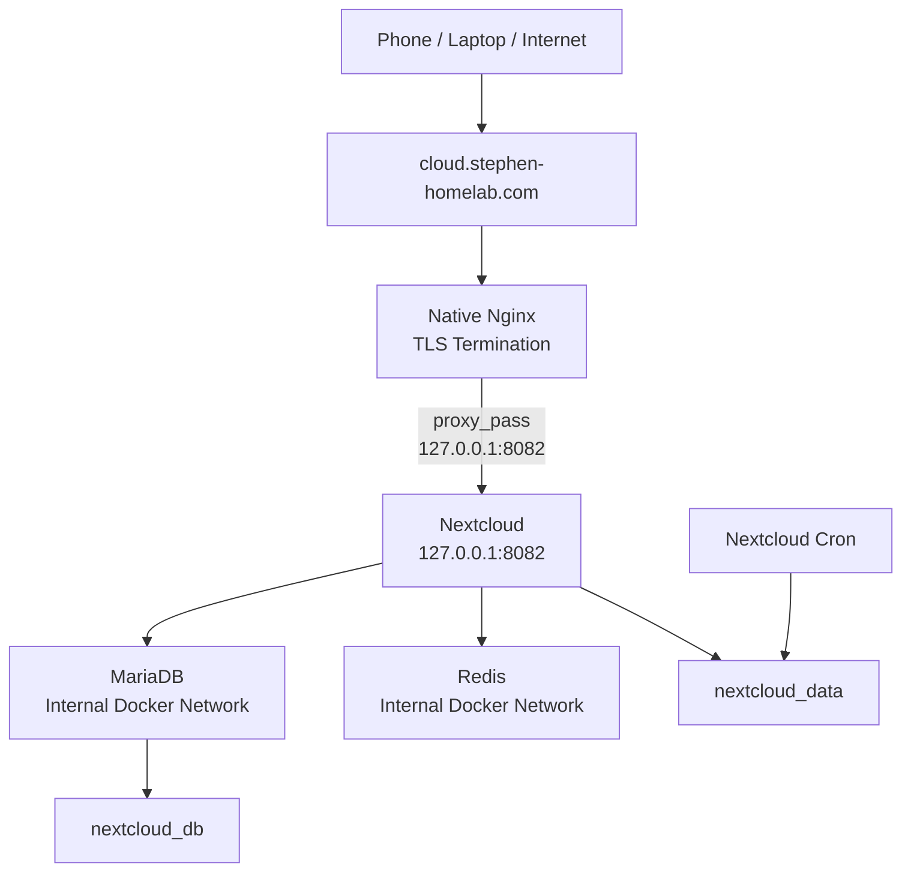

# Stage 06 — Nextcloud with MariaDB, Redis and Persistent Storage

## Objective

Deploy a personal self-hosted cloud using Nextcloud while preserving the infrastructure and security model established in Stages 1–5.

This stage introduces:

- a stateful multi-container application
- MariaDB
- Redis
- persistent Docker volumes
- Docker internal DNS
- background job processing
- application-specific reverse proxy configuration
- public file storage over HTTPS

Nextcloud is publicly available through:

```text
https://cloud.stephen-homelab.com
```

---

## Architecture



---

## Request Flow

When a user accesses:

```text
https://cloud.stephen-homelab.com
```

the request follows:

```text
Client
  ↓
Public DNS
  ↓
Home public IPv4
  ↓
Router TCP 443
  ↓
ThinkPad 192.168.1.98
  ↓
UFW
  ↓
Native Nginx
  ↓
TLS termination
  ↓
proxy_pass http://127.0.0.1:8082
  ↓
Nextcloud container
```

Nextcloud then communicates internally with:

```text
MariaDB
Redis
Persistent Docker volumes
```

---

# 1. Project Structure

The Nextcloud deployment is located at:

```text
~/homelab/nextcloud
```

Structure:

```text
nextcloud/
├── compose.yaml
├── .env
└── .env.example
```

The real `.env` file is excluded from Git.

---

# 2. Environment Configuration

The `.env` file contains the MariaDB credentials:

```env
MYSQL_ROOT_PASSWORD=<generated-root-password>
MYSQL_PASSWORD=<generated-nextcloud-db-password>

MYSQL_DATABASE=nextcloud
MYSQL_USER=nextcloud
```

The passwords were generated using:

```bash
openssl rand -base64 32
```

File permissions were restricted:

```bash
chmod 600 .env
```

The Git-safe `.env.example` contains placeholders:

```env
MYSQL_ROOT_PASSWORD=CHANGE_ME
MYSQL_PASSWORD=CHANGE_ME

MYSQL_DATABASE=nextcloud
MYSQL_USER=nextcloud
```

---

# 3. Docker Compose Architecture

The application consists of four containers:

```text
nextcloud-app
nextcloud-db
nextcloud-redis
nextcloud-cron
```

The services communicate through a dedicated Docker bridge network.

---

## Nextcloud Application

Nextcloud runs using the Apache-based Docker image.

The host binding is:

```text
127.0.0.1:8082 → container:80
```

This means Nextcloud cannot be accessed directly through:

```text
192.168.1.98:8082
```

from another LAN device.

Only applications running on the ThinkPad, such as native Nginx, can reach it.

This preserves the same backend-hardening model introduced in Stage 5.

---

## MariaDB

MariaDB provides the Nextcloud database.

It stores application state such as:

- users
- configuration
- file metadata
- shares
- application metadata

MariaDB is not published to the host.

Nextcloud connects to it through Docker DNS using:

```text
db:3306
```

The database container IP does not need to be known or hard-coded.

---

## Redis

Redis is used by Nextcloud for:

- caching
- transactional file locking

Redis is not published to the host.

Nextcloud reaches it through:

```text
redis:6379
```

over the private Docker network.

---

## Cron

The `nextcloud-cron` container executes Nextcloud background jobs.

It shares the same persistent Nextcloud volume as the application container.

This allows scheduled tasks to run independently of browser activity.

---

# 4. Docker Internal Networking

The services share:

```text
nextcloud_backend
```

Docker provides internal DNS resolution based on Compose service names.

Therefore:

```text
Nextcloud
   ├── db
   └── redis
```

is used instead of hard-coded container IP addresses.

This is important because Docker container IPs can change when containers are recreated.

---

# 5. Persistent Storage

Stage 6 introduces persistent application state.

Two named volumes are used:

```text
nextcloud_data
nextcloud_db
```

---

## Nextcloud Volume

The Nextcloud volume is mounted at:

```text
/var/www/html
```

Conceptually:

```text
Nextcloud
    ↓
/var/www/html
    ↓
nextcloud_data
    ↓
ThinkPad disk
```

This stores persistent Nextcloud data, configuration, installed applications, and user files.

---

## MariaDB Volume

MariaDB persists its database under:

```text
/var/lib/mysql
```

Conceptually:

```text
MariaDB
    ↓
/var/lib/mysql
    ↓
nextcloud_db
```

---

## Container vs Data Lifecycle

Running:

```bash
docker compose down
```

removes the containers and Compose network but retains named volumes.

Running:

```bash
docker compose down -v
```

also removes named volumes.

For a stateful service such as Nextcloud, `docker compose down -v` can therefore destroy persistent data.

---

# 6. Public DNS

A public DNS record was created:

```text
cloud.stephen-homelab.com
    ↓
Home public IPv4
```

Cloudflare is used as the DNS provider.

The record is configured as:

```text
DNS only
```

so the request travels directly from the client to the home public IP rather than through the Cloudflare HTTP proxy.

---

# 7. Router Configuration

No additional router port forwarding was required.

The existing Stage 5 rules remain:

```text
WAN TCP 80
    ↓
192.168.1.98:80
```

```text
WAN TCP 443
    ↓
192.168.1.98:443
```

Nginx differentiates applications using the requested hostname.

---

# 8. Native Nginx Reverse Proxy

Native Nginx remains the only public HTTP/HTTPS application entry point.

For Nextcloud:

```text
cloud.stephen-homelab.com
        ↓
Native Nginx
        ↓
127.0.0.1:8082
        ↓
Nextcloud
```

The reverse proxy configuration includes:

```nginx
server_name cloud.stephen-homelab.com;

client_max_body_size 10G;

location / {
    proxy_pass http://127.0.0.1:8082;

    proxy_http_version 1.1;

    proxy_set_header Host $host;
    proxy_set_header X-Real-IP $remote_addr;
    proxy_set_header X-Forwarded-For $proxy_add_x_forwarded_for;
    proxy_set_header X-Forwarded-Proto $scheme;

    proxy_read_timeout 3600;
    proxy_send_timeout 3600;

    proxy_request_buffering off;
}
```

WebDAV redirects were also configured for:

```text
/.well-known/carddav
/.well-known/caldav
```

---

# 9. TLS and HTTPS

A Let's Encrypt certificate was obtained for:

```text
cloud.stephen-homelab.com
```

using Certbot.

Nginx terminates TLS.

Externally:

```text
Client
  ↓ HTTPS
Native Nginx
```

Internally:

```text
Native Nginx
  ↓ HTTP
127.0.0.1:8082
  ↓
Nextcloud
```

---

## Why `OVERWRITEPROTOCOL=https` Is Required

Nextcloud directly receives an HTTP request from Nginx even though the original client connected using HTTPS.

Without additional configuration, Nextcloud could incorrectly interpret the original request as HTTP.

The application therefore uses:

```text
OVERWRITEPROTOCOL=https
```

This tells Nextcloud that its canonical external protocol is HTTPS.

Nginx also forwards:

```text
X-Forwarded-Proto: https
```

when the original request uses HTTPS.

---

# 10. Trusted Domain

Nextcloud is configured to accept:

```text
cloud.stephen-homelab.com
```

as a trusted domain.

This can be checked with:

```bash
docker compose exec -u www-data app \
  php occ config:system:get trusted_domains
```

---

# 11. HTTPS Verification

Certificate status:

```bash
sudo certbot certificates
```

HTTP response:

```bash
curl -I https://cloud.stephen-homelab.com
```

TLS verification:

```bash
openssl s_client \
  -connect cloud.stephen-homelab.com:443 \
  -servername cloud.stephen-homelab.com
```

The certificate:

- matches `cloud.stephen-homelab.com`
- uses a valid Let's Encrypt chain
- successfully validates from external clients

---

# 12. Using Nextcloud

Nextcloud can now be used as personal Internet-accessible file storage.

Users can connect through:

### Web Browser

```text
https://cloud.stephen-homelab.com
```

### Nextcloud Desktop Client

The desktop client synchronizes local folders with the server.

### Nextcloud Mobile Application

The iOS / Android application connects using:

```text
https://cloud.stephen-homelab.com
```

### WebDAV

Nextcloud can also be mounted using WebDAV-compatible clients.

---

# 13. Multi-User Access

Friends and family should receive separate Nextcloud user accounts.

Do not share the administrator account.

Example:

```text
Nextcloud
├── stephen
├── friend1
├── friend2
└── family-member
```

Each account has separate private storage.

Files and folders can be shared explicitly between users.

Storage quotas can also be configured per account.

---

# 14. Monitoring Integration

No additional Prometheus or Grafana instance was required.

The existing Stage 4 monitoring stack continues to monitor the server.

---

## Node Exporter

Node Exporter monitors host-level resources such as:

```text
CPU
memory
disk
filesystem
network
uptime
```

---

## cAdvisor

cAdvisor automatically discovers the new Docker containers:

```text
nextcloud-app
nextcloud-db
nextcloud-redis
nextcloud-cron
```

and exposes their container-level metrics.

---

## Monitoring Flow

```text
Nextcloud Containers
        ↓
     cAdvisor
        ↓
    Prometheus
        ↓
      Grafana
```

---

# 15. Monitoring Hardening

The monitoring stack was also hardened before completing Stage 6.

Grafana is bound only to:

```text
127.0.0.1:3000
```

Prometheus does not require a host-published port because Grafana accesses it using:

```text
prometheus:9090
```

over Docker networking.

cAdvisor also does not require a host-published port because Prometheus scrapes:

```text
cadvisor:8080
```

internally.

Node Exporter continues to use host networking and port `9100`, with access restricted to the required monitoring path.

---

# 16. Validation

Check containers:

```bash
cd ~/homelab/nextcloud
docker compose ps
```

Check port mappings:

```bash
docker ps --format 'table {{.Names}}\t{{.Ports}}'
```

Expected Nextcloud mapping:

```text
127.0.0.1:8082->80/tcp
```

MariaDB may display:

```text
3306/tcp
```

and Redis:

```text
6379/tcp
```

without being host-published.

A host-published database would instead look like:

```text
0.0.0.0:3306->3306/tcp
```

which is not desired.

---

## Backend Test

```bash
curl -I http://127.0.0.1:8082
```

---

## Host Socket Check

```bash
sudo ss -tlnp | grep -E ':80|:443|:8082|:3306|:6379'
```

Expected important listeners:

```text
0.0.0.0:80
0.0.0.0:443
127.0.0.1:8082
```

MariaDB and Redis should not have host-published listeners.

---

## Nextcloud Status

```bash
docker compose exec -u www-data app php occ status
```

Expected:

```text
installed: true
maintenance: false
```

---

# 17. Operational Setup Warnings

Nextcloud's administration overview identified several follow-up operational items.

These included:

- log errors requiring review
- maintenance window not configured
- mimetype migrations available
- database configuration checks requiring review
- HSTS header not yet configured
- AppAPI deploy daemon not configured

Not all of these are security vulnerabilities.

Some relate to:

```text
security
maintenance
performance
database optimization
optional application functionality
```

The HSTS warning is a security-hardening item and should be configured at native Nginx because Nginx terminates HTTPS.

---

# 18. Troubleshooting Method

Troubleshooting continues to follow the layered method established in Stage 5.

---

## 1. Container State

```bash
docker compose ps
```

---

## 2. Backend

```bash
curl -I http://127.0.0.1:8082
```

---

## 3. Nextcloud Logs

```bash
docker compose logs --tail=100 app
```

---

## 4. Database Logs

```bash
docker compose logs --tail=100 db
```

---

## 5. Redis Logs

```bash
docker compose logs --tail=100 redis
```

---

## 6. Nginx

```bash
sudo nginx -t
sudo systemctl status nginx
```

---

## 7. DNS

```bash
dig +short cloud.stephen-homelab.com
```

---

## 8. TLS

```bash
openssl s_client \
  -connect cloud.stephen-homelab.com:443 \
  -servername cloud.stephen-homelab.com
```

---

## 9. Full Request

```bash
curl -v https://cloud.stephen-homelab.com
```

---

# 19. Security Model

The Nextcloud deployment follows these principles:

- public access occurs only through Nginx
- only TCP 80 and 443 are forwarded by the router
- Nextcloud binds only to `127.0.0.1:8082`
- MariaDB is Docker-internal
- Redis is Docker-internal
- HTTPS terminates at native Nginx
- database credentials are stored in `.env`
- `.env` is excluded from Git
- certificate private keys are never committed
- separate Nextcloud accounts are used for individual users
- monitoring services are not publicly exposed

---

# 20. What Stage 6 Added

Stage 6 introduced:

- stateful Docker workloads
- persistent Docker volumes
- MariaDB
- Redis
- Docker internal DNS
- service-to-service networking
- multi-container application architecture
- application-specific reverse proxy configuration
- Nextcloud desktop and mobile clients
- multi-user file storage
- Internet-accessible self-hosted cloud storage

The main conceptual change is:

```text
Container
    ≠
Persistent Data
```

Containers can be recreated.

Important state survives through:

```text
nextcloud_data
nextcloud_db
```

However, persistent volumes are not backups.

The next major operational stage should implement backups and restore testing for both Nextcloud data and MariaDB.

